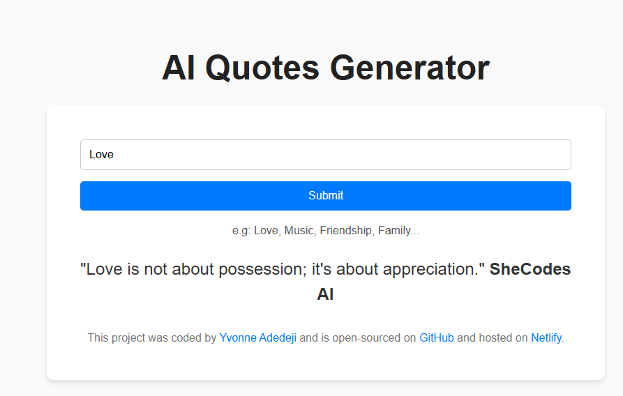

# ai-generator-project 

## 📌 Description
The AI Quotes Generator is a simple web application that uses AI to generate quotes based on user-entered keywords. With a clean and intuitive interface, users can input any word and receive an AI-generated quote related to that keyword. The app is designed with a typewriter effect, creating an engaging experience while the quote is being displayed.

## 🛠 Prerequisites
N/A

## 📋 Criteria
* Allow users to input any keyword
* Fetch an AI-generated quote related to the keyword
* Display the quote with a typewriter effect
* Provide a clean and responsive interface

 ## 💻 Technologies Used
The application is built with the following technologies:
* HTML
* CSS
* JavaScript
* TypewriterJS
* Axios 

## 🚀 Installation
No installation is required to use the app. It is hosted online and can be accessed via a web browser.

## 📚 Usage
1. Open the web application in your browser.
2. Enter a keyword in the input field.
3. Click the Submit button to generate a related quote.
4. The quote will be displayed on the page with a typewriter effect.
5. Enjoy the AI-generated quote and experiment with different keywords.

## 🔗 Live Demo & Repository
Application can be viewed here: 
* [Live](https://ya-ai-quote-generator-project.netlify.app/)

* [Repository](https://github.com/yvonnesarah/ai-generator-project)

## 🖼 Screenshot
Below is a preview of AI Quotes Generator:

## 👥 Credit
TypewriterJS: Used for creating the typewriter effect in displaying the quotes.
Axios: Used to handle HTTP requests for generating quotes.

## 📜 License
This project is open-source. For licensing details, please refer to the LICENSE file in the repository.

## 📬 Contact
You can reach me at 📧 yvonneadedeji.sarah@gmail.com.
